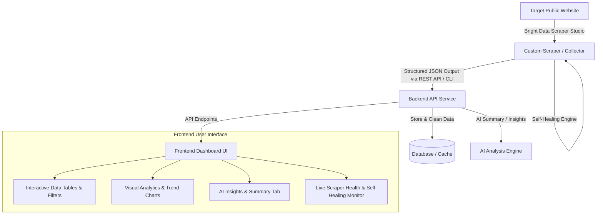

# 🚀 Hackathon Project Blueprint: Into the Scrape-Verse
> **Organizers:** WeMakeDevs & Bright Data  
> **Dates:** August 17 – August 23, 2026 (7 Days)  
> **Team Goal:** Build an end-to-end intelligent web application powered by **Bright Data Scraper Studio** with self-healing capabilities.

---

## 📌 1. What is this Hackathon About? (In Simple Words)

### The Core Problem
Traditional web scrapers break constantly. If a website redesigns its layout or changes a CSS class name (e.g., from `.price-tag` to `.product-amount`), ordinary scrapers return empty (`null`) data or crash downstream applications.

### The Solution: Bright Data Scraper Studio
With **Scraper Studio**, we define data fields in plain English (e.g., *"Product Title, Discounted Price, Rating, Stock Status"*). Bright Data automatically generates the scraper. If the target website changes its layout, Bright Data's **Self-Healing Engine** automatically updates the extraction rules so our application keeps receiving data with **Zero Downtime**.

---

## 🏗️ 2. High-Level System Architecture

---

## 🎯 3. What We Are Building: *OmniPulse — Intelligent Market & Price Radar*

### 💡 Project Overview
An end-to-end web platform that monitors product prices, tech hardware, or market trends across e-commerce/retail platforms in real time. It uses **Bright Data Scraper Studio** to reliably harvest publicly available web data and delivers actionable insights to users.

### ✨ Key Features of the Application:
1. **📊 Live Data Dashboard:**
   * Interactive product cards, multi-level search, filtering by price, brand, rating, and stock status.
2. **📈 Price Analytics & Trend Charts:**
   * Historical price drops, average category price comparisons, and deal score calculations.
3. **🤖 AI-Powered Smart Insights:**
   * Instant AI summary of whether a product is a "Good Buy", price prediction, and spec comparisons.
4. **🛡️ Scraper Ops & Self-Healing Health Monitor (Crucial for Winning!):**
   * A dedicated tab in the UI displaying:
     * Collector status (`Active`, `Healthy`).
     * Real-time extraction latency and row count.
     * **Self-Healing Log** (demonstrating how the collector recovers if a site changes).
5. **🔔 Alert Triggers:**
   * Simulated price drop and in-stock notification triggers.

---

## 🛠️ 4. Recommended Technology Stack

| Layer | Recommended Technology | Purpose |
| :--- | :--- | :--- |
| **Scraping Engine** | **Bright Data Scraper Studio** | Custom web scraper, proxy management, self-healing |
| **Frontend UI** | **React / Next.js / Vite + Vanilla CSS / Tailwind** | Responsive dashboard, cards, interactive search |
| **Charts & Graphs** | **Recharts / Chart.js / Lucide Icons** | Visual data analytics & price trends |
| **Backend API** | **Node.js (Express) or Python (FastAPI)** | Fetches data from Bright Data API, serves frontend |
| **Database / Cache** | **SQLite / PostgreSQL / LowDB** | Stores historical runs and structured data |
| **AI Integration** | **OpenAI / Gemini API** *(Optional)* | Generates automated summaries & product insights |

---

## 🏆 5. Prize Tracks & Winning Strategy

We are targeting all 3 prize tracks:

1. 🥇 **Web-Slinger Track — Grand Prize ($5,000 or NVIDIA DGX Spark):**
   * *How we win:* Deep, seamless integration with Bright Data Scraper Studio, programmatic API triggering, and a live demonstration of Scraper Studio's self-healing capabilities.
2. 🎨 **Suit-Up Track — Best UI (Apple iPads for the team):**
   * *How we win:* Modern, pixel-perfect, responsive UI with smooth animations, dark/light theme, and intuitive data visualizations.
3. ⚡ **Spider-Sense Track — Best Clean Code (Keychron Keyboards for the team):**
   * *How we win:* Modular folder structure, type safety, error boundaries, clean documentation, and well-commented code.

---

## 👥 6. Team Roles & Task Breakdown (For up to 4 Members)

| Role | Responsibilities |
| :--- | :--- |
| **Member 1: Data & Scraping Lead** | • Set up Bright Data account & redeem promo code `wemakedevs`. • Create custom scraper in Scraper Studio and test fields. • Implement self-healing simulation & export Collector ID. |
| **Member 2: Backend & Data Pipeline** | • Build the REST API (Node.js/FastAPI) to trigger and fetch Bright Data results. • Set up data storage (SQLite/JSON/Postgres) and filtering logic. • Integrate optional AI summary endpoint (Gemini/OpenAI). |
| **Member 3: Frontend & Dashboard Lead** | • Build the main web app UI (Dashboard, Filters, Search, Product Cards). • Create data visualization charts (Price trends, Stock metrics). • Build the Scraper Health Status widget. |
| **Member 4: UI Polish, Docs & Demo Lead** | • Polish CSS animations, mobile responsiveness, and design aesthetics. • Write comprehensive `README.md` with architecture diagrams. • Record & edit the 3-5 minute demo video highlighting Scraper Studio. |

---

## 📋 7. Hackathon Submission Requirements Checklist

Before the deadline (August 23, 2026), our team must prepare:
- [ ] **Public GitHub Repository:** Clean code, no committed API keys (use `.env.example`).
- [ ] **Comprehensive `README.md`:** Explaining problem statement, architecture, setup guide, and Bright Data integration.
- [ ] **Sample Structured Output:** JSON and CSV export files generated by our scraper.
- [ ] **3–5 Minute Video Demo:** 
  1. Quick problem pitch.
  2. Bright Data Scraper Studio walkthrough & Collector ID setup.
  3. Live application demo (Frontend UI + Analytics).
  4. Resilience & Self-Healing explanation.

---

## 📅 8. 7-Day Action Plan

* **Day 1 (Aug 17):** Align on blueprint, claim $50 credits (`wemakedevs`), create custom scraper in Scraper Studio.
* **Day 2 (Aug 18):** Scaffold Backend API + connect Bright Data API to fetch structured JSON data.
* **Day 3 (Aug 19):** Build core Frontend Dashboard (Cards, Tables, Filters, Search).
* **Day 4 (Aug 20):** Implement Visual Analytics (Charts, Trends) & AI Insights.
* **Day 5 (Aug 21):** Add Scraper Ops & Health Monitor (Self-healing demonstration).
* **Day 6 (Aug 22):** Code cleanup, UI responsiveness, edge-case testing, and documentation.
* **Day 7 (Aug 23):** Record video demo, final commit to GitHub, and submit project!
